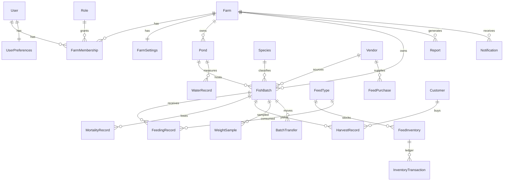

# SQLAlchemy 2.0 ORM Model Design

> **Phase:** 5 — ORM Domain Model Design  
> **Status:** Approved — Pre-Implementation  
> **Project:** PondDesk Fish Farm Management Platform  
> **Stack:** SQLAlchemy 2.0 · PostgreSQL 15+ · Alembic · Python 3.13+ · Pydantic v2

Transforms Phase 2 database architecture into production-ready SQLAlchemy 2.0 declarative models. No routes, repositories, or services.

## Related Documents

- [Domain Model](./01-domain-model.md) — Phase 1 business entities
- [Database Architecture](./02-database-architecture.md) — Phase 2 table specs (source of truth for columns)
- [API Contract](./03-api-contract.md) — Phase 3 response shapes
- [Backend Architecture](./04-backend-architecture.md) — Phase 4 `models/` folder layout
- [Migration Strategy](./06-migration-strategy.md) — Phase 6 Alembic handbook
- [Pydantic Schemas](./07-pydantic-schemas.md) — Phase 7 DTO layer (ORM → Response mapping)
- [Repository Layer](./08-repository-layer.md) — Phase 8 data access (persists these models)
- [Database Guide](../database/README.md) — Quick reference

---

## Table of Contents

- [1. Model Overview](#1-model-overview)
- [2. Model Specifications](#2-model-specifications)
- [3. Relationship Diagram](#3-relationship-diagram)
- [4. Mixins](#4-mixins)
- [5. Enums](#5-enums)
- [6. Validation Strategy](#6-validation-strategy)
- [7. Computed Properties](#7-computed-properties)
- [8. ORM Best Practices](#8-orm-best-practices)
- [9. SQLAlchemy Design Rationale](#9-sqlalchemy-design-rationale)

---

## 1. Model Overview

### 1.1 Design Goals

| Goal | Approach |
|------|----------|
| **SQLAlchemy 2.0 only** | `Mapped[]` / `mapped_column()` — no legacy `Column()` declarative |
| **Fully typed** | Every attribute annotated; mypy-compatible |
| **Alembic-ready** | Single `Base.metadata`; models importable from `app.models` |
| **Tenant-safe** | `farm_id` on all operational models |
| **Thin ORM** | Models map tables; business rules stay in services/domain |
| **Compatible with Phase 2** | Column names, types, FKs, indexes match Phase 2 exactly |

### 1.2 Target Package Layout

```
app/models/
├── __init__.py              # Re-export all models for Alembic
├── identity/
│   ├── user.py
│   ├── role.py
│   ├── farm_membership.py
│   └── refresh_token.py
├── farm/
│   ├── farm.py
│   ├── farm_settings.py
│   └── user_preferences.py
├── catalog/
│   ├── species.py
│   ├── feed_category.py
│   ├── feed_type.py
│   ├── vendor.py
│   └── customer.py
├── operations/
│   ├── pond.py
│   ├── fish_batch.py
│   ├── batch_transfer.py
│   ├── feeding_record.py
│   ├── mortality_record.py
│   ├── weight_sample.py
│   ├── water_record.py
│   └── harvest_record.py
├── inventory/
│   ├── feed_inventory.py
│   ├── feed_purchase.py
│   └── inventory_transaction.py
└── platform/
    ├── report.py
    ├── notification.py
    └── audit_log.py
```

### 1.3 Model Catalog

| Model | Table | Soft Delete | Mixins | Aggregate Role |
|-------|-------|-------------|--------|----------------|
| `User` | `users` | Yes | Timestamp, SoftDelete | Identity root |
| `Role` | `roles` | No | Timestamp | Permission bundle |
| `FarmMembership` | `farm_memberships` | Yes | Timestamp, SoftDelete | User↔Farm M:N |
| `RefreshToken` | `refresh_tokens` | No (revoke) | Timestamp | Auth session |
| `Farm` | `farms` | Yes | Timestamp, SoftDelete | Tenant root |
| `FarmSettings` | `farm_settings` | No | Timestamp (updated only) | Farm config (1:1) |
| `UserPreferences` | `user_preferences` | No | Timestamp (updated only) | User config (1:1) |
| `Species` | `species` | No (is_active) | Timestamp | Catalog |
| `FeedCategory` | `feed_categories` | No (is_active) | Timestamp | Catalog |
| `FeedType` | `feed_types` | No (is_active) | Timestamp | Catalog |
| `Vendor` | `vendors` | Yes | Timestamp, SoftDelete | Catalog |
| `Customer` | `customers` | Yes | Timestamp, SoftDelete | Catalog |
| `Pond` | `ponds` | Yes | Timestamp, SoftDelete, Audit | Production master |
| `FishBatch` | `fish_batches` | Yes | Timestamp, SoftDelete, Audit | Production aggregate |
| `BatchTransfer` | `batch_transfers` | **Never** | — | Immutable history |
| `FeedingRecord` | `feeding_records` | Yes (void) | Timestamp, SoftDelete, RecordedBy | Operational fact |
| `MortalityRecord` | `mortality_records` | Yes (void) | SoftDelete, RecordedBy | Operational fact |
| `WeightSample` | `weight_samples` | **Never** | RecordedBy | Operational fact |
| `WaterRecord` | `water_records` | Yes (void) | Timestamp, SoftDelete, RecordedBy | Pond-scoped fact |
| `HarvestRecord` | `harvest_records` | Yes (void) | SoftDelete, RecordedBy | Operational fact |
| `FeedInventory` | `feed_inventory` | No | Timestamp (updated) | Stock balance |
| `FeedPurchase` | `feed_purchases` | **Never** | RecordedBy | Acquisition fact |
| `InventoryTransaction` | `inventory_transactions` | **Never** | RecordedBy | Immutable ledger |
| `Report` | `reports` | No | Timestamp | Async job metadata |
| `Notification` | `notifications` | No | Timestamp (created) | Alert inbox |
| `AuditLog` | `audit_log` | **Never** | — | Append-only trail |

### 1.4 Permission Model Note

Phase 2 stores permissions as **`jsonb` on `roles`**, not a separate `permissions` table. Phase 4 RBAC uses permission strings (`harvest:create`). ORM design:

- **`Role.permissions: Mapped[list[str]]`** — JSONB list of permission strings
- No `Permission` ORM entity in Phase 5
- Python `Permission` enum / constants live in `app/core/constants.py` or `app/permissions/`
- Future: normalize to `permissions` + `role_permissions` tables without changing API contract

### 1.5 Settings Model Note

"Settings" in the product maps to two ORM models:

| Product Concept | ORM Model | Scope |
|-----------------|-----------|-------|
| Farm Settings | `FarmSettings` | 1:1 with `Farm` |
| User Preferences | `UserPreferences` | 1:1 with `User` |

---

## 2. Model Specifications

Conventions for all models below:

- PK: `id: Mapped[uuid.UUID]` with `server_default=text("gen_random_uuid()")`
- Timestamps: `timestamptz` via `DateTime(timezone=True)`
- Money/weight: `Numeric(precision, scale)` — never `Float`
- Enums: PostgreSQL native enums via SQLAlchemy `Enum(..., name=..., native_enum=True)`
- Style: SQLAlchemy 2.0 declarative with `DeclarativeBase`

---

### 2.1 User

**Purpose:** Platform identity for every human operator.  
**Business responsibility:** Authentication credentials, display identity, activity attribution.  
**Lifecycle:** Created on register → active → soft-deleted (never hard-deleted while referenced by facts).

| Column | Type | Nullable | Unique | Default / Server Default | Index |
|--------|------|----------|--------|--------------------------|-------|
| `id` | `Uuid` | NO | PK | `gen_random_uuid()` | PK |
| `email` | `String(255)` | NO | YES | — | Unique |
| `password_hash` | `String(255)` | NO | — | — | — |
| `full_name` | `String(200)` | NO | — | — | — |
| `phone` | `String(30)` | YES | — | — | — |
| `is_active` | `Boolean` | NO | — | `True` | — |
| `email_verified_at` | `DateTime(tz)` | YES | — | — | — |
| `last_login_at` | `DateTime(tz)` | YES | — | — | — |
| `created_at` | `DateTime(tz)` | NO | — | `now()` | — |
| `updated_at` | `DateTime(tz)` | NO | — | `now()` / onupdate | — |
| `deleted_at` | `DateTime(tz)` | YES | — | — | Partial |

**Relationships:**

| Relationship | Target | Cardinality | `back_populates` | Cascade | Lazy |
|--------------|--------|-------------|------------------|---------|------|
| `memberships` | `FarmMembership` | 1:N | `user` | — | `selectin` |
| `preferences` | `UserPreferences` | 1:1 | `user` | `all, delete-orphan` | `selectin` |
| `refresh_tokens` | `RefreshToken` | 1:N | `user` | `all, delete-orphan` | `raise` |

**Deferred:** `password_hash` — load only in auth flows (`deferred=True`).

---

### 2.2 Role

**Purpose:** Named permission bundle (ADMIN, MANAGER, WORKER).  
**Business responsibility:** Authorization boundary for farm memberships.  
**Lifecycle:** Seeded at deploy; rarely mutated; never soft-deleted.

| Column | Type | Nullable | Unique | Default | Index |
|--------|------|----------|--------|---------|-------|
| `id` | `Uuid` | NO | PK | `gen_random_uuid()` | PK |
| `name` | `String(50)` | NO | YES | — | Unique |
| `description` | `Text` | YES | — | — | — |
| `permissions` | `JSONB` | NO | — | `[]` | GIN (optional) |
| `created_at` | `DateTime(tz)` | NO | — | `now()` | — |

**Relationships:**

| Relationship | Target | Cardinality | Lazy |
|--------------|--------|-------------|------|
| `memberships` | `FarmMembership` | 1:N | `raise` |

**Note:** `permissions` is `Mapped[list[str]]` with `mapped_column(JSONB, server_default=text("'[]'::jsonb"))`.

---

### 2.3 FarmMembership

**Purpose:** Assigns a user to a farm with a role.  
**Business responsibility:** Multi-tenant access control.  
**Lifecycle:** Join → active → soft-revoke (`deleted_at` or `is_active=False`).

| Column | Type | Nullable | Unique | Default | Index |
|--------|------|----------|--------|---------|-------|
| `id` | `Uuid` | NO | PK | `gen_random_uuid()` | PK |
| `farm_id` | `Uuid` | NO | FK | — | Composite unique |
| `user_id` | `Uuid` | NO | FK | — | `(user_id, farm_id)` |
| `role_id` | `Uuid` | NO | FK | — | FK index |
| `is_active` | `Boolean` | NO | — | `True` | — |
| `joined_at` | `DateTime(tz)` | NO | — | `now()` | — |
| `created_at` | `DateTime(tz)` | NO | — | `now()` | — |
| `deleted_at` | `DateTime(tz)` | YES | — | — | Partial unique |

**Unique:** `(farm_id, user_id)` WHERE `deleted_at IS NULL`

**Relationships:** `user`, `farm`, `role` — all `many-to-one`, `lazy="joined"` for auth resolution (small rows).

---

### 2.4 Farm

**Purpose:** Tenant root — commercial fish farming operation.  
**Business responsibility:** Scopes all operational data; owns ponds, batches, inventory.  
**Lifecycle:** Created on onboarding → active → soft-deleted.

| Column | Type | Nullable | Unique | Default | Index |
|--------|------|----------|--------|---------|-------|
| `id` | `Uuid` | NO | PK | `gen_random_uuid()` | PK |
| `name` | `String(200)` | NO | — | — | — |
| `slug` | `String(100)` | NO | YES | — | Unique |
| `location` | `String(500)` | YES | — | — | — |
| `timezone` | `String(64)` | NO | — | `'Africa/Lagos'` | — |
| `measurement_unit` | `Enum(MeasurementUnit)` | NO | — | `METRIC` | — |
| `pond_count` | `SmallInteger` | YES | — | — | — |
| `farm_size_hectares` | `Numeric(8,2)` | YES | — | — | — |
| `license_number` | `String(100)` | YES | — | — | — |
| `is_active` | `Boolean` | NO | — | `True` | — |
| `created_at` / `updated_at` / `deleted_at` | `DateTime(tz)` | — | — | Mixins | — |

**Relationships (selected):**

| Relationship | Target | Cascade | Lazy |
|--------------|--------|---------|------|
| `settings` | `FarmSettings` | `all, delete-orphan` | `selectin` |
| `ponds` | `Pond` | — | `raise` |
| `fish_batches` | `FishBatch` | — | `raise` |
| `memberships` | `FarmMembership` | — | `selectin` |
| `vendors` / `customers` | Catalog | — | `raise` |
| `notifications` | `Notification` | — | `raise` |

**Rule:** Never cascade-delete operational facts from `Farm`. Soft-delete farm; facts remain for audit.

---

### 2.5 FarmSettings (Settings — Farm)

**Purpose:** Farm operational policies and alert thresholds.  
**Business responsibility:** Configurable business rules (edit windows, alert %).  
**Lifecycle:** Created with farm; updated in place; never soft-deleted.

| Column | Type | Nullable | Unique | Default |
|--------|------|----------|--------|---------|
| `id` | `Uuid` | NO | PK | `gen_random_uuid()` |
| `farm_id` | `Uuid` | NO | FK, UNIQUE | — |
| `max_batches_per_pond` | `SmallInteger` | NO | — | `1` |
| `feeding_edit_window_hours` | `SmallInteger` | NO | — | `24` |
| `mortality_alert_threshold_pct` | `Numeric(5,2)` | NO | — | `5.00` |
| `water_test_frequency_hours` | `SmallInteger` | NO | — | `24` |
| `alert_thresholds` | `JSONB` | NO | — | `{}` |
| `notification_defaults` | `JSONB` | NO | — | `{}` |
| `updated_at` | `DateTime(tz)` | NO | — | `now()` |

**Relationship:** `farm` — 1:1 via `uselist=False` on `Farm.settings`.

---

### 2.6 UserPreferences (Settings — User)

**Purpose:** Per-user UI and notification preferences.  
**Lifecycle:** Created with user; updated in place.

| Column | Type | Nullable | Unique | Default |
|--------|------|----------|--------|---------|
| `id` | `Uuid` | NO | PK | `gen_random_uuid()` |
| `user_id` | `Uuid` | NO | FK, UNIQUE | — |
| `theme` | `Enum(Theme)` | NO | — | `LIGHT` |
| `language` | `String(10)` | NO | — | `'en'` |
| `date_format` | `String(20)` | NO | — | `'DD/MM/YYYY'` |
| `timezone_override` | `String(64)` | YES | — | — |
| `notification_prefs` | `JSONB` | NO | — | `{}` |
| `updated_at` | `DateTime(tz)` | NO | — | `now()` |

---

### 2.7 Species

**Purpose:** Biological catalog for batches.  
**Business responsibility:** Species-specific water thresholds and naming.  
**Lifecycle:** System-wide (`farm_id=NULL`) or farm-custom; deactivate via `is_active`.

| Column | Type | Nullable | Notes |
|--------|------|----------|-------|
| `id` | `Uuid` | NO | PK |
| `farm_id` | `Uuid` | YES | NULL = global catalog |
| `name` | `String(100)` | NO | — |
| `scientific_name` | `String(150)` | YES | — |
| `optimal_temp_min/max` | `Numeric(4,1)` | YES | Threshold eval |
| `optimal_ph_min/max` | `Numeric(3,1)` | YES | Threshold eval |
| `is_active` | `Boolean` | NO | Default `True` |
| `created_at` | `DateTime(tz)` | NO | — |

**Relationships:** `fish_batches` 1:N, `lazy="raise"`.

---

### 2.8 Pond

**Purpose:** Physical production enclosure.  
**Business responsibility:** Hosts batches; owns water records.  
**Lifecycle:** Created → EMPTY/ACTIVE/MAINTENANCE/DRAINED → soft-deleted.

| Column | Type | Nullable | Default | Index |
|--------|------|----------|---------|-------|
| `id` | `Uuid` | NO | `gen_random_uuid()` | PK |
| `farm_id` | `Uuid` | NO | FK | `idx_ponds_farm` |
| `name` | `String(100)` | NO | — | Partial unique `(farm_id, name)` |
| `pond_type` | `Enum(PondType)` | NO | `EARTHEN` | — |
| `status` | `Enum(PondStatus)` | NO | `EMPTY` | — |
| `water_source` | `String(100)` | YES | — | — |
| `volume_m3` | `Numeric(10,2)` | YES | — | — |
| `surface_area_m2` | `Numeric(10,2)` | YES | — | — |
| `max_depth_m` | `Numeric(4,2)` | YES | — | — |
| `max_fish_count` | `Integer` | YES | — | CHECK > 0 |
| `max_biomass_kg` | `Numeric(10,2)` | YES | — | — |
| `has_aeration` | `Boolean` | NO | `False` | — |
| `has_sensors` | `Boolean` | NO | `False` | — |
| `notes` | `Text` | YES | — | — |
| `created_by` | `Uuid` | YES | FK → users | — |
| Mixins | timestamps + soft delete | — | — | — |

**Relationships:**

| Relationship | Target | Notes | Lazy |
|--------------|--------|-------|------|
| `farm` | `Farm` | many-to-one | `joined` optional |
| `fish_batches` | `FishBatch` | 1:N over lifetime | `selectin` on detail |
| `water_records` | `WaterRecord` | **Pond only** | `raise` |
| `feeding_records` | `FeedingRecord` | denorm location | `raise` |

**Critical:** No `water_records` relationship on `FishBatch`.

---

### 2.9 FishBatch

**Purpose:** Central production aggregate — cohort from stocking to closure.  
**Business responsibility:** Population, growth, harvest eligibility.  
**Lifecycle:** PLANNED → ACTIVE → HARVEST_READY → HARVESTED/CLOSED/WRITTEN_OFF.

| Column | Type | Nullable | Default | Index |
|--------|------|----------|---------|-------|
| `id` | `Uuid` | NO | PK | PK |
| `farm_id` | `Uuid` | NO | FK (denorm) | `(farm_id, status)` |
| `pond_id` | `Uuid` | NO | FK | `idx_batches_pond` |
| `species_id` | `Uuid` | NO | FK | FK |
| `vendor_id` | `Uuid` | YES | FK SET NULL | — |
| `batch_code` | `String(50)` | NO | — | Partial unique `(farm_id, batch_code)` |
| `status` | `Enum(BatchStatus)` | NO | `PLANNED` | — |
| `stocking_date` | `Date` | YES | — | `(farm_id, stocking_date)` |
| `expected_harvest_date` | `Date` | YES | — | Partial harvest KPI |
| `actual_harvest_date` | `Date` | YES | — | — |
| `initial_quantity` | `Integer` | NO | — | CHECK > 0 |
| `current_quantity` | `Integer` | NO | — | CHECK ≥ 0 |
| `initial_avg_weight_kg` | `Numeric(8,4)` | YES | — | — |
| `current_avg_weight_kg` | `Numeric(8,4)` | YES | — | — |
| `stocking_cost` | `Numeric(12,2)` | YES | — | — |
| `notes` | `Text` | YES | — | — |
| `created_by` | `Uuid` | YES | FK | — |
| Mixins | timestamps + soft delete | — | — | — |

**Partial unique:** one ACTIVE/HARVEST_READY batch per `pond_id`.

**Relationships:**

| Relationship | Target | Cascade | Lazy |
|--------------|--------|---------|------|
| `pond` | `Pond` | — | `joined` on detail |
| `species` | `Species` | — | `joined` on detail |
| `vendor` | `Vendor` | — | `selectin` |
| `feeding_records` | `FeedingRecord` | — | `raise` |
| `mortality_records` | `MortalityRecord` | — | `raise` |
| `harvest_records` | `HarvestRecord` | — | `raise` |
| `weight_samples` | `WeightSample` | — | `raise` |
| `transfers` | `BatchTransfer` | — | `selectin` on history |

**Why `current_quantity` is stored:** High-frequency operational state updated atomically by mortality/harvest services — not a hybrid property aggregate.

---

### 2.10 FeedingRecord

**Purpose:** Single feeding event.  
**Business responsibility:** Feed compliance, inventory consumption source.  
**Lifecycle:** SCHEDULED → COMPLETED / MISSED / SKIPPED; void via soft delete.

| Column | Type | Nullable | Default | Index |
|--------|------|----------|---------|-------|
| `id` | `Uuid` | NO | PK | PK |
| `farm_id` | `Uuid` | NO | FK | `(farm_id, feeding_date DESC)` |
| `fish_batch_id` | `Uuid` | NO | FK | `(fish_batch_id, fed_at DESC)` |
| `pond_id` | `Uuid` | NO | FK (denorm) | — |
| `feed_type_id` | `Uuid` | NO | FK | — |
| `feeding_date` | `Date` | NO | — | Daily grouping |
| `fed_at` | `DateTime(tz)` | NO | — | — |
| `quantity_kg` | `Numeric(10,3)` | NO | — | CHECK > 0 when COMPLETED |
| `status` | `Enum(FeedingStatus)` | NO | `COMPLETED` | `(farm_id, status, feeding_date)` |
| `feeding_method` | `Enum(FeedingMethod)` | NO | `MANUAL` | — |
| `weather` | `String(50)` | YES | — | — |
| `notes` | `Text` | YES | — | — |
| `recorded_by` | `Uuid` | NO | FK | — |
| Mixins | timestamps + soft delete | — | — | — |

**Relationships:** `fish_batch`, `pond`, `feed_type`, `recorder` (`User`) — all many-to-one, `lazy="raise"` by default; `selectin` when listing with names.

---

### 2.11 FeedInventory

**Purpose:** Current stock balance per feed type per farm.  
**Business responsibility:** Reorder alerts, feeding eligibility.  
**Lifecycle:** Created on first purchase; balance updated via ledger; never soft-deleted.

| Column | Type | Nullable | Default | Index |
|--------|------|----------|---------|-------|
| `id` | `Uuid` | NO | PK | PK |
| `farm_id` | `Uuid` | NO | FK | Unique `(farm_id, feed_type_id)` |
| `feed_type_id` | `Uuid` | NO | FK | — |
| `quantity_on_hand` | `Numeric(12,3)` | NO | `0` | CHECK ≥ 0; partial low-stock |
| `reorder_level` | `Numeric(10,3)` | YES | — | — |
| `storage_location` | `String(100)` | YES | — | — |
| `last_restocked_at` | `DateTime(tz)` | YES | — | — |
| `updated_at` | `DateTime(tz)` | NO | `now()` | — |

**Relationships:** `feed_type` (joined), `transactions` → `InventoryTransaction` (`lazy="raise"`).

---

### 2.12 FeedPurchase

**Purpose:** Feed acquisition event.  
**Business responsibility:** Cost capture and inventory replenishment trigger.  
**Lifecycle:** Append-only fact; never soft-deleted.

| Column | Type | Nullable | Default |
|--------|------|----------|---------|
| `id` | `Uuid` | NO | PK |
| `farm_id` | `Uuid` | NO | FK |
| `vendor_id` | `Uuid` | NO | FK |
| `feed_type_id` | `Uuid` | NO | FK |
| `purchase_date` | `Date` | NO | — |
| `quantity_kg` | `Numeric(12,3)` | NO | — |
| `unit_price` | `Numeric(12,2)` | NO | — |
| `total_cost` | `Numeric(12,2)` | NO | — |
| `invoice_ref` | `String(100)` | YES | — |
| `payment_status` | `Enum(PaymentStatus)` | NO | `PENDING` |
| `recorded_by` | `Uuid` | NO | FK |
| `created_at` | `DateTime(tz)` | NO | `now()` |

---

### 2.13 WaterRecord

**Purpose:** Pond water quality snapshot.  
**Business responsibility:** Environmental monitoring and alerts.  
**Lifecycle:** Recorded → optionally voided; **always pond-scoped**.

| Column | Type | Nullable | Default | Index |
|--------|------|----------|---------|-------|
| `id` | `Uuid` | NO | PK | PK |
| `farm_id` | `Uuid` | NO | FK | `(farm_id, water_test_date DESC)` |
| `pond_id` | `Uuid` | NO | FK | `(pond_id, tested_at DESC)` |
| `water_test_date` | `Date` | NO | — | — |
| `tested_at` | `DateTime(tz)` | NO | — | — |
| `temperature_c` | `Numeric(4,1)` | YES | — | CHECK 0–45 |
| `ph` | `Numeric(3,2)` | YES | — | CHECK 0–14 |
| `dissolved_oxygen_mgl` | `Numeric(4,2)` | YES | — | — |
| `ammonia_ppm` / `nitrite_ppm` / `nitrate_ppm` | `Numeric(6,4)` | YES | — | — |
| `turbidity_ntu` | `Numeric(6,2)` | YES | — | — |
| `water_level_pct` | `SmallInteger` | YES | — | CHECK 0–100 |
| `water_depth_m` | `Numeric(4,2)` | YES | — | — |
| `water_color` / `weather` | `String(50)` | YES | — | — |
| `status` | `Enum(WaterStatus)` | NO | `HEALTHY` | `(farm_id, status, tested_at)` |
| `source` | `Enum(RecordSource)` | NO | `MANUAL` | — |
| `notes` | `Text` | YES | — | — |
| `photo_url` | `String(500)` | YES | — | Deferred |
| `recorded_by` | `Uuid` | YES | FK (NULL for sensors) | — |
| Mixins | timestamps + soft delete | — | — | — |

**Relationships:** `pond` only (many-to-one). **No `fish_batch_id` column.**

---

### 2.14 MortalityRecord

**Purpose:** Death loss event for a batch.  
**Business responsibility:** Reduces `FishBatch.current_quantity`; survival analytics.  
**Lifecycle:** Recorded → optionally voided (restore quantity in service).

| Column | Type | Nullable | Default | Index |
|--------|------|----------|---------|-------|
| `id` | `Uuid` | NO | PK | PK |
| `farm_id` | `Uuid` | NO | FK | — |
| `fish_batch_id` | `Uuid` | NO | FK | `(fish_batch_id, recorded_at DESC)` |
| `pond_id` | `Uuid` | NO | FK (denorm) | — |
| `recorded_at` | `DateTime(tz)` | NO | — | — |
| `quantity` | `Integer` | NO | — | CHECK > 0 |
| `cause` | `Enum(MortalityCause)` | NO | `UNKNOWN` | — |
| `notes` | `Text` | YES | — | — |
| `recorded_by` | `Uuid` | NO | FK | — |
| `created_at` | `DateTime(tz)` | NO | `now()` | — |
| `deleted_at` | `DateTime(tz)` | YES | — | Void |

---

### 2.15 HarvestRecord

**Purpose:** Fish removal (partial or full).  
**Business responsibility:** Revenue event; reduces batch population; may close batch.  
**Lifecycle:** SCHEDULED → COMPLETED / CANCELLED; void via soft delete.

| Column | Type | Nullable | Default | Index |
|--------|------|----------|---------|-------|
| `id` | `Uuid` | NO | PK | PK |
| `farm_id` | `Uuid` | NO | FK | `(farm_id, harvest_date DESC)` |
| `fish_batch_id` | `Uuid` | NO | FK | `(fish_batch_id, harvested_at DESC)` |
| `pond_id` | `Uuid` | NO | FK (denorm) | — |
| `customer_id` | `Uuid` | YES | FK SET NULL | — |
| `harvest_date` | `Date` | NO | — | — |
| `harvested_at` | `DateTime(tz)` | NO | — | — |
| `harvest_type` | `Enum(HarvestType)` | NO | — | — |
| `status` | `Enum(HarvestStatus)` | NO | `COMPLETED` | — |
| `quantity` | `Integer` | NO | — | CHECK > 0 |
| `avg_weight_kg` | `Numeric(8,4)` | NO | — | — |
| `total_weight_kg` | `Numeric(12,3)` | NO | — | CHECK > 0 |
| `price_per_kg` | `Numeric(12,2)` | YES | — | — |
| `notes` | `Text` | YES | — | — |
| `recorded_by` | `Uuid` | NO | FK | — |
| `created_at` | `DateTime(tz)` | NO | `now()` | — |
| `deleted_at` | `DateTime(tz)` | YES | — | Void |

**Relationships:** `fish_batch`, `pond`, `customer`, `recorder`.

---

### 2.16 Report

**Purpose:** Async report job + artifact metadata.  
**Business responsibility:** Track generation status and download URL.  
**Lifecycle:** PENDING → GENERATING → READY / FAILED.

| Column | Type | Nullable | Default | Index |
|--------|------|----------|---------|-------|
| `id` | `Uuid` | NO | PK | PK |
| `farm_id` | `Uuid` | NO | FK | `(farm_id, created_at DESC)` |
| `report_type` | `Enum(ReportType)` | NO | — | — |
| `title` | `String(300)` | NO | — | — |
| `date_from` / `date_to` | `Date` | YES | — | — |
| `format` | `Enum(ReportFormat)` | NO | — | — |
| `status` | `Enum(ReportStatus)` | NO | `PENDING` | — |
| `file_url` | `String(500)` | YES | — | Deferred |
| `parameters` | `JSONB` | YES | — | — |
| `generated_by` | `Uuid` | NO | FK | — |
| `generated_at` | `DateTime(tz)` | YES | — | — |
| `created_at` | `DateTime(tz)` | NO | `now()` | — |

---

### 2.17 Notification

**Purpose:** In-app alert / reminder.  
**Business responsibility:** Deliver operational signals to users.  
**Lifecycle:** Created unread → marked read; retained for history.

| Column | Type | Nullable | Default | Index |
|--------|------|----------|---------|-------|
| `id` | `Uuid` | NO | PK | PK |
| `farm_id` | `Uuid` | NO | FK | `(farm_id, is_read, created_at DESC)` |
| `user_id` | `Uuid` | YES | FK | NULL = farm broadcast |
| `type` | `Enum(NotificationType)` | NO | — | — |
| `severity` | `Enum(NotificationSeverity)` | NO | — | — |
| `title` | `String(200)` | NO | — | — |
| `message` | `Text` | NO | — | — |
| `entity_type` | `String(50)` | YES | — | Polymorphic link |
| `entity_id` | `Uuid` | YES | — | — |
| `is_read` | `Boolean` | NO | `False` | — |
| `read_at` | `DateTime(tz)` | YES | — | — |
| `created_at` | `DateTime(tz)` | NO | `now()` | — |

---

### 2.18 Supporting Models (Required by Phase 2)

These are part of the ORM layer even if not listed in the Phase 5 prompt header:

| Model | Purpose |
|-------|---------|
| `RefreshToken` | Hashed refresh sessions; revoke via `revoked_at` |
| `FeedCategory` / `FeedType` | Feed catalog hierarchy |
| `Vendor` / `Customer` | Supply/sales parties |
| `BatchTransfer` | Immutable pond-move history |
| `WeightSample` | Growth curve samples |
| `InventoryTransaction` | Append-only stock ledger |
| `AuditLog` | Append-only compliance trail |

---

## 3. Relationship Diagram

### 3.1 ORM Relationship Map



### 3.2 Cardinality Summary

| Type | Pairs |
|------|-------|
| **1:1** | `Farm`↔`FarmSettings`, `User`↔`UserPreferences` |
| **1:N** | `Farm`→`Pond`→`WaterRecord`; `FishBatch`→feedings/mortality/harvests |
| **M:N** | `User`↔`Farm` via `FarmMembership` |

### 3.3 Relationship Loading Semantics

| Strategy | When to use | PondDesk examples |
|----------|-------------|-------------------|
| **`lazy="raise"`** (default) | Prevent accidental N+1 | Most collections |
| **`lazy="selectin"`** | Load collections in 2 queries | `User.memberships`, batch detail children |
| **`lazy="joined"`** | Small parent row always needed | `FarmMembership.role`, batch `species` on detail |
| **`lazy="noload"`** | Explicitly exclude | Heavy collections on list endpoints |

### 3.4 Cascade Rules

| Parent → Child | Cascade | Why |
|----------------|---------|-----|
| `User` → `UserPreferences` | `all, delete-orphan` | Preferences die with user |
| `Farm` → `FarmSettings` | `all, delete-orphan` | Settings die with farm |
| `User` → `RefreshToken` | `all, delete-orphan` | Sessions die with user |
| `Farm` → `Pond` / facts | **None** | Soft-delete only; preserve history |
| `FishBatch` → facts | **None** | Facts are independent audit records |
| `FeedInventory` → transactions | **None** | Ledger is immutable |

**FK `ondelete`:** Prefer `RESTRICT` for facts; `SET NULL` for optional refs (`vendor_id`, `customer_id`, `created_by`).

### 3.5 `back_populates` Convention

Always bidirectional with explicit `back_populates` (never `backref`):

```
Pond.fish_batches  ↔  FishBatch.pond
Pond.water_records ↔  WaterRecord.pond
FishBatch.feeding_records ↔ FeedingRecord.fish_batch
```

---

## 4. Mixins

### 4.1 Base

```
DeclarativeBase
  └── Base (app.database.base)
        └── All models
```

`Base.metadata` is the single Alembic target.

### 4.2 Mixin Catalog

| Mixin | Columns | Used By |
|-------|---------|---------|
| **`TimestampMixin`** | `created_at`, `updated_at` | Masters + mutable facts |
| **`CreatedAtMixin`** | `created_at` only | Immutable facts (`FeedPurchase`, `AuditLog`, `BatchTransfer`) |
| **`SoftDeleteMixin`** | `deleted_at` | Masters + voidable facts |
| **`AuditCreateMixin`** | `created_by` | `Pond`, `FishBatch` |
| **`RecordedByMixin`** | `recorded_by` | Feeding, mortality, harvest, water, purchases, ledger |
| **`FarmScopedMixin`** | `farm_id` + index | All operational / tenant tables |

### 4.3 Inheritance Matrix

| Model | Timestamp | SoftDelete | FarmScoped | AuditCreate | RecordedBy |
|-------|-----------|------------|------------|-------------|------------|
| User | ✓ | ✓ | — | — | — |
| Role | created only | — | — | — | — |
| Farm | ✓ | ✓ | — | — | — |
| FarmSettings | updated | — | ✓ | — | — |
| Pond | ✓ | ✓ | ✓ | ✓ | — |
| FishBatch | ✓ | ✓ | ✓ | ✓ | — |
| FeedingRecord | ✓ | ✓ | ✓ | — | ✓ |
| WaterRecord | ✓ | ✓ | ✓ | — | ✓ (nullable) |
| MortalityRecord | created | ✓ | ✓ | — | ✓ |
| HarvestRecord | created | ✓ | ✓ | — | ✓ |
| FeedInventory | updated | — | ✓ | — | — |
| FeedPurchase | created | — | ✓ | — | ✓ |
| InventoryTransaction | created | — | —* | — | ✓ |
| BatchTransfer | — | — | — | — | ✓ |
| Report | created | — | ✓ | — | generated_by |
| Notification | created | — | ✓ | — | — |
| AuditLog | created | — | optional | — | — |

\* `InventoryTransaction` scopes via `feed_inventory.farm_id`; optional denorm `farm_id` allowed for query speed.

### 4.4 Soft-Delete Query Pattern

Repositories must always filter `deleted_at IS NULL` unless explicitly querying voids. Prefer a custom `with_loader_criteria` or repository helper — not a global session event that hides rows unexpectedly during audits.

---

## 5. Enums

Define in `app/core/constants.py` (or `app/models/enums.py`) as Python `enum.StrEnum`, mapped to PostgreSQL enums.

### 5.1 Required Enums (from prompt + Phase 2)

| Python Enum | PG Name | Values |
|-------------|---------|--------|
| `UserRoleName` | *(table data, not PG enum)* | `ADMIN`, `MANAGER`, `WORKER` |
| `PondStatus` | `pond_status_enum` | `EMPTY`, `ACTIVE`, `MAINTENANCE`, `DRAINED` |
| `BatchStatus` | `batch_status_enum` | `PLANNED`, `ACTIVE`, `HARVEST_READY`, `HARVESTED`, `CLOSED`, `WRITTEN_OFF` |
| `HarvestStatus` | `harvest_status_enum` | `SCHEDULED`, `COMPLETED`, `CANCELLED` |
| `WaterStatus` | `water_status_enum` | `HEALTHY`, `WARNING`, `CRITICAL` |
| `NotificationType` | `notification_type_enum` | `FEEDING_DUE`, `LOW_INVENTORY`, `WATER_ALERT`, `MORTALITY_SPIKE`, `HARVEST_DUE`, `WEATHER`, `SYSTEM` |

### 5.2 Additional Phase 2 Enums

| Python Enum | Values |
|-------------|--------|
| `PondType` | `EARTHEN`, `CONCRETE`, `CAGE`, `RACEWAY` |
| `FeedingStatus` | `SCHEDULED`, `COMPLETED`, `MISSED`, `SKIPPED` |
| `FeedingMethod` | `MANUAL`, `AUTOMATIC` |
| `HarvestType` | `PARTIAL`, `FULL` |
| `MortalityCause` | `DISEASE`, `WATER_STRESS`, `PREDATION`, `HANDLING`, `TREATMENT`, `UNKNOWN` |
| `RecordSource` | `MANUAL`, `SENSOR` |
| `PaymentStatus` | `PENDING`, `PAID`, `PARTIAL`, `OVERDUE`, `CANCELLED` |
| `ReportType` | `DAILY_FEEDING`, `WATER_QUALITY`, `HARVEST`, `INVENTORY`, `BATCH`, `POND_SUMMARY`, `FARM_STATS` |
| `ReportFormat` | `PDF`, `EXCEL`, `CSV` |
| `ReportStatus` | `PENDING`, `GENERATING`, `READY`, `FAILED` |
| `NotificationSeverity` | `INFO`, `WARNING`, `CRITICAL` |
| `InventoryTxType` | `PURCHASE`, `FEEDING`, `ADJUSTMENT`, `SPOILAGE`, `CORRECTION` |
| `MeasurementUnit` | `METRIC`, `IMPERIAL` |
| `Theme` | `LIGHT`, `DARK` |
| `VendorCategory` | `FINGERLING`, `FEED`, `CHEMICAL`, `EQUIPMENT`, `OTHER` |

### 5.3 Permission Constants (not a DB enum)

```
Permission strings: "ponds:read", "ponds:create", "harvest:create", "reports:export", ...
Stored in Role.permissions JSONB
Defined as StrEnum or Final constants in app/permissions/
```

### 5.4 Enum Mapping Rules

- Use `values_callable=lambda x: [e.value for e in x]` for stable Alembic diffs
- `native_enum=True`, `create_constraint=True`
- Never rename enum values in place — add new values via Alembic `ALTER TYPE`

---

## 6. Validation Strategy

ORM models enforce **data integrity**, not full business workflows.

### 6.1 Layers Reminder

| Layer | Responsibility |
|-------|----------------|
| Pydantic schemas | Request shape / format |
| Domain + services | Harvest ≤ available fish, active batch rules |
| ORM / DB CHECK | Non-negotiable physical bounds |
| Unique / partial unique | Concurrency-safe uniqueness |

### 6.2 Model / DB CHECK Validations

| Field | Rule | Location |
|-------|------|----------|
| Temperature | `0 ≤ temperature_c ≤ 45` | `WaterRecord` CHECK |
| pH | `0 ≤ ph ≤ 14` | `WaterRecord` CHECK |
| Water level % | `0–100` | `WaterRecord` CHECK |
| Fish count (initial) | `> 0` | `FishBatch` CHECK |
| Fish count (current) | `≥ 0` | `FishBatch` CHECK |
| Feed quantity | `> 0` when COMPLETED | `FeedingRecord` CHECK |
| Mortality quantity | `> 0` | `MortalityRecord` CHECK |
| Harvest quantity / weight | `> 0` | `HarvestRecord` CHECK |
| Stock on hand | `≥ 0` | `FeedInventory` CHECK |
| Pond capacity | `max_fish_count > 0` if set | `Pond` CHECK |

### 6.3 `@validates` Hooks (Optional, Light)

Use SQLAlchemy `@validates` only for simple field guards that mirror CHECKs (defense in depth):

| Model | Validator | Behavior |
|-------|-----------|----------|
| `WaterRecord` | `temperature_c`, `ph` | Raise `ValueError` if out of range |
| `FeedingRecord` | `quantity_kg` | Must be > 0 |
| `MortalityRecord` | `quantity` | Must be > 0 |
| `HarvestRecord` | `quantity`, `total_weight_kg` | Must be > 0 |
| `FishBatch` | `current_quantity` | Must be ≥ 0 |
| `User` | `email` | Normalize lowercase |

**Do not** put harvest-vs-population checks in `@validates` — that requires reading related rows and belongs in `HarvestService`.

### 6.4 Application-Only Validations (Services)

| Rule | Why not ORM |
|------|-------------|
| Harvest quantity ≤ `current_quantity` | Needs transactional lock on batch |
| Mortality ≤ population | Same |
| Feeding requires sufficient inventory | Multi-aggregate |
| No ops on CLOSED batches | State machine in domain |
| One active batch per pond | Enforced by partial unique + service |

---

## 7. Computed Properties

Use `@hybrid_property` when filterable in SQL; plain `@property` when Python-only.

### 7.1 FishBatch

| Property | Type | Formula | Notes |
|----------|------|---------|-------|
| `age_days` | hybrid | `(today - stocking_date).days` | `None` if not stocked |
| `days_until_harvest` | hybrid | `(expected_harvest_date - today).days` | Negative = overdue |
| `survival_rate` | hybrid | `current_quantity / initial_quantity` | Guard `initial > 0` |
| `estimated_biomass_kg` | property | `current_quantity * current_avg_weight_kg` | Needs both fields |
| `is_active_production` | property | `status in {ACTIVE, HARVEST_READY}` | Convenience |
| `is_closed` | property | `status in {HARVESTED, CLOSED, WRITTEN_OFF}` | — |

### 7.2 HarvestRecord

| Property | Type | Formula |
|----------|------|---------|
| `total_revenue` | hybrid | `total_weight_kg * price_per_kg` (NULL-safe) |
| `computed_total_weight` | property | `quantity * avg_weight_kg` — compare to stored `total_weight_kg` for QA |

**Note:** Persist `total_weight_kg` as source of truth (Phase 2); computed property is for validation/display only.

### 7.3 Pond

| Property | Type | Formula |
|----------|------|---------|
| `active_batches` | relationship filter / property | Batches where `status in ACTIVE, HARVEST_READY` and `deleted_at IS NULL` |
| `active_batch_count` | hybrid / subquery | Count of active batches |
| `is_available_for_stocking` | property | `status == EMPTY` or policy allows + under capacity |

Prefer repository query methods (`list_active_batches(pond_id)`) over loading all batches into memory for `active_batches`.

### 7.4 FeedInventory

| Property | Type | Formula |
|----------|------|---------|
| `is_low_stock` | hybrid | `reorder_level IS NOT NULL AND quantity_on_hand < reorder_level` |
| `days_of_feed_remaining` | property | Requires avg daily consumption — compute in service/report layer |

### 7.5 FeedingRecord / WaterRecord

| Property | Model | Formula |
|----------|-------|---------|
| `is_void` | Soft-deleted facts | `deleted_at is not None` |
| `is_critical` | `WaterRecord` | `status == CRITICAL` |

---

## 8. ORM Best Practices

### 8.1 Indexes (Mirror Phase 2)

Declare indexes on `__table_args__`:

- Tier 1 tenancy composites: `(farm_id, …)`
- History: `(fish_batch_id, fed_at DESC)`
- Partial unique: active batch per pond; unique pond name where not deleted
- Partial: low inventory where `quantity_on_hand < reorder_level`

### 8.2 Relationship Loading

| Endpoint pattern | Strategy |
|------------------|----------|
| List ponds | No batch collection; return summaries |
| Pond detail | `selectinload(Pond.fish_batches)` filtered active |
| Batch detail | `joinedload` species/pond; `selectinload` recent feedings |
| Daily feedings list | `selectinload` batch + feed_type names only |
| Dashboard KPIs | Aggregates in repository SQL — not ORM graph walk |

### 8.3 Deferred Columns

| Column | Model | Why |
|--------|-------|-----|
| `password_hash` | `User` | Security + size |
| `photo_url` | `WaterRecord` | Rarely needed in lists |
| `file_url` | `Report` | Large URL; list shows status |
| `notes` (optional) | Large text fields | Defer on list queries if profiling warrants |
| `old_values` / `new_values` | `AuditLog` | Heavy JSONB |

### 8.4 Eager Loading Rules

1. Default: `lazy="raise"` on collections
2. Explicit `selectinload` / `joinedload` in repository methods
3. Never `lazy="select"` (legacy N+1 trap) on collections
4. Cap collection loads with `limit` in queries — don't load entire feeding history into a batch detail by default

### 8.5 Session & Identity Map

- One `AsyncSession` per request (Phase 4)
- Models are not committed in repositories
- Avoid `expire_on_commit=False` unless carefully justified for background tasks
- Refresh batch after mortality/harvest updates when returning to caller

### 8.6 Alembic Compatibility

- Import all models in `app/models/__init__.py`
- `target_metadata = Base.metadata` in `migrations/env.py`
- Autogenerate + manual review for enums and partial indexes
- Never edit old revisions; add new ones

### 8.7 Naming

| Item | Convention |
|------|------------|
| Class | `FishBatch` |
| Table | `fish_batches` |
| FK attr | `pond_id` + relationship `pond` |
| Constraint names | `fk_fish_batches_pond_id`, `ck_fish_batches_qty_nonnegative` |

---

## 9. SQLAlchemy Design Rationale

### 9.1 Why SQLAlchemy 2.0 Declarative

| Decision | Rationale |
|----------|-----------|
| `Mapped[]` / `mapped_column` | Static typing; IDE support; mypy |
| Async engine + session | Matches FastAPI async stack (ADR-009) |
| Native PG enums | Aligns with Phase 2; efficient storage |
| JSONB for role permissions | Extensible without migration per permission |
| No Active Record saves | Services own transactions (ADR-004) |

### 9.2 Why Thin Models

ORM models are **persistence mappings**, not domain services. Putting harvest eligibility on the model couples HTTP-agnostic domain rules to SQLAlchemy sessions and invites anemic/god-object confusion. Domain rules live in `app/domain/rules/`; models expose data + light hybrids.

### 9.3 Why Denormalized `farm_id` / `pond_id` on Facts

Phase 2 denormalizes tenancy and location onto feeding/mortality/harvest/water rows so list queries avoid joins. ORM mirrors this with explicit columns + relationships — not association proxies that hide the denorm.

### 9.4 Why WaterRecord → Pond Only

Matches Phase 1/2 critical rule. Modeling `fish_batch_id` on water would break polyculture and duplicate environmental facts. ORM forbids the relationship by omitting the column.

### 9.5 Why Immutable Ledgers Have No SoftDeleteMixin

`InventoryTransaction`, `AuditLog`, `BatchTransfer` must never disappear. Soft-delete mixin would invite accidental voids. Corrections are new compensating transactions.

### 9.6 Performance Implications Summary

| Choice | Benefit | Cost |
|--------|---------|------|
| UUID PKs | Offline/mobile safe | Larger indexes than BIGINT |
| `selectin` collections | Avoids N+1 | Extra query per collection |
| `joined` small parents | One round-trip | Wider rows |
| Deferred secrets/URLs | Smaller list payloads | Extra query when accessed |
| Partial indexes | Fast active-batch / low-stock | Write overhead |
| Stored `current_quantity` | O(1) reads | Must update in same TX as facts |

### 9.7 Implementation Readiness Checklist

- [ ] Create `app/database/base.py` + mixins
- [ ] Create enum module matching Phase 2 names
- [ ] Implement models per package layout §1.2
- [ ] Export all models from `app/models/__init__.py`
- [ ] Configure Alembic `env.py` with async URL
- [ ] Generate initial migration; verify partial uniques + CHECKs
- [ ] Add repository interfaces (Phase 6) consuming these models
- [ ] Confirm no `fish_batch_id` on `WaterRecord`

---

**Document Status:** Ready for ORM implementation.  
**Next Phase:** Phase 6 — Repository interfaces & SQLAlchemy implementations (still no routes/services until models migrate cleanly).
