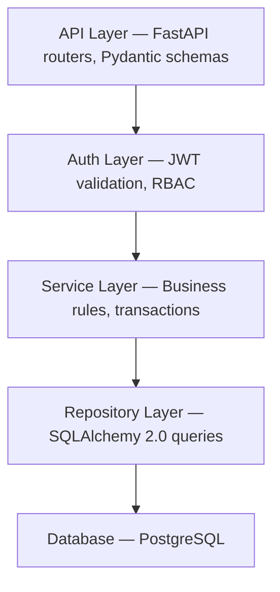
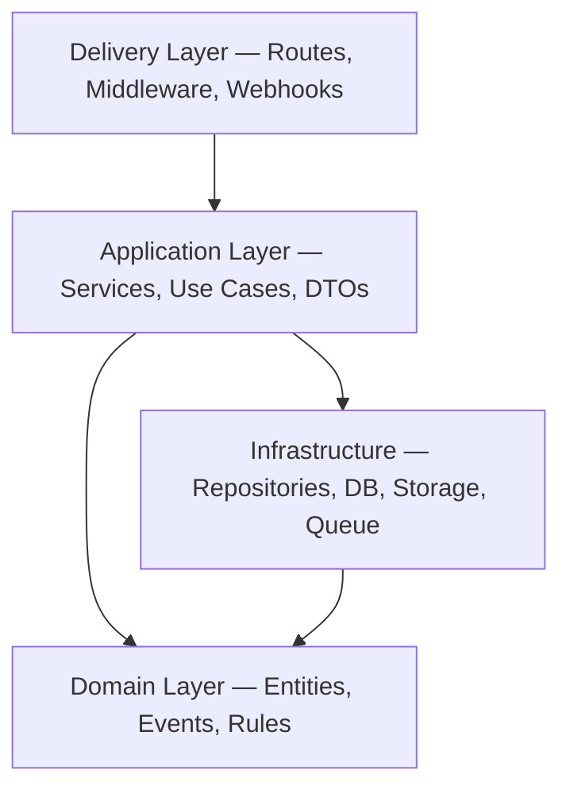
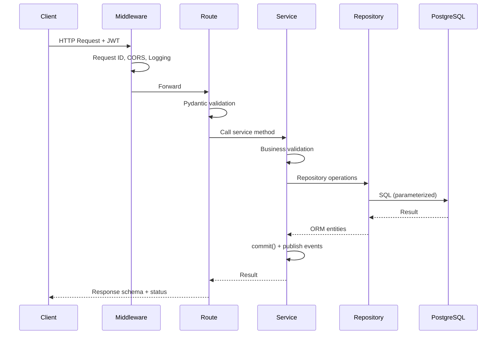

# API & Backend Layer Diagrams

> **Sources:** [API Contract §1.3](../architecture/03-api-contract.md#13-architectural-layers) · [Backend Architecture §1.1](../architecture/04-backend-architecture.md#11-architectural-style)

## API Architectural Layers (Phase 3)

## Clean Architecture (Phase 4)

Dependencies point **inward only**.

## Request Lifecycle

## Related Documents

- [API Contract](../architecture/03-api-contract.md)
- [Backend Architecture](../architecture/04-backend-architecture.md)
- [Dependency Injection §7](../architecture/04-backend-architecture.md#7-dependency-injection-design)
