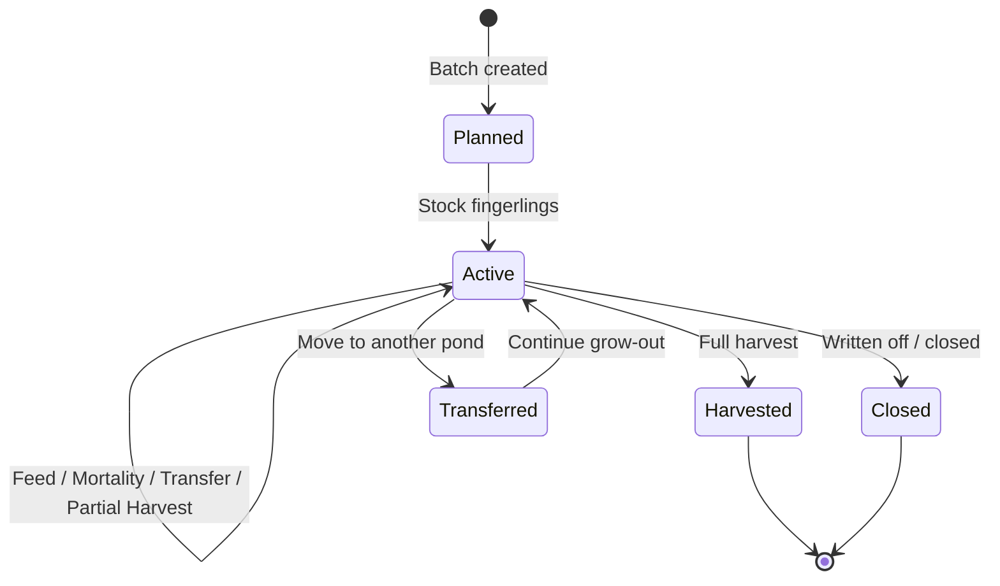

# Fish Batch Lifecycle

> **Source:** [Domain Model §6](../architecture/01-domain-model.md#6-fish-batch-lifecycle)

## State Diagram

## Lifecycle Events

| Stage | Domain Events | Information Generated |
|-------|---------------|----------------------|
| **Planned** | `BatchPlanned` | Species, target pond, expected stocking date |
| **Active** | `BatchStocked`, `FeedingRecorded`, `MortalityRecorded` | Population, weight samples, FCR, survival rate |
| **Harvest** | `HarvestCompleted`, `BatchPartiallyHarvested` | Count, weight, revenue, buyer |
| **Closed** | `BatchClosed` | Final survival, total feed cost, ROI summary |

## Related Documents

- [Domain Model §6](../architecture/01-domain-model.md#6-fish-batch-lifecycle)
- [Business Rules §3.4](../architecture/01-domain-model.md#34-state-transition-rules)
- [Database: fish_batches](../architecture/02-database-architecture.md#fish_batches)
