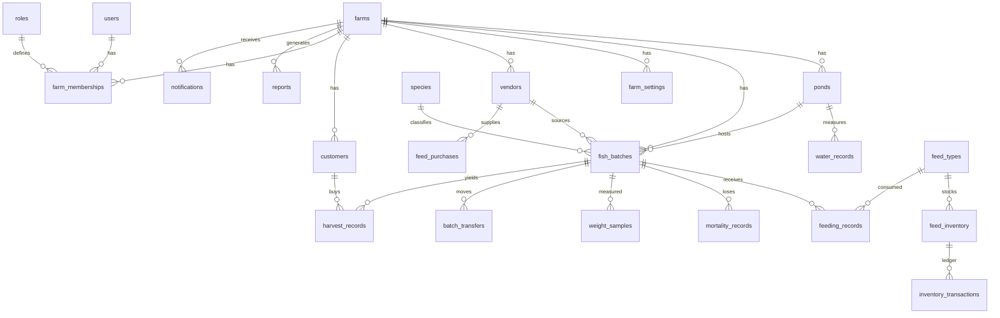
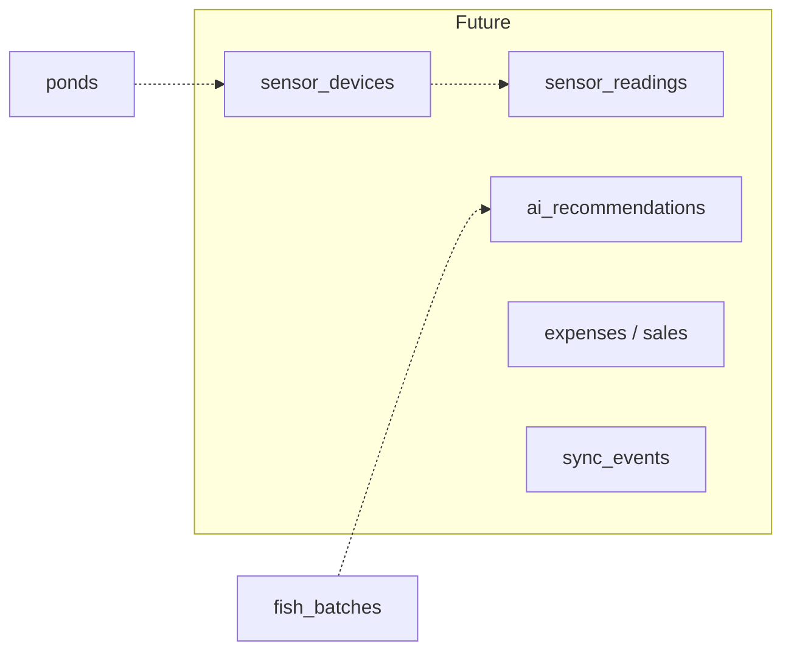

# Complete Entity Relationship Diagram

> **Source:** [Database Architecture §14](../architecture/02-database-architecture.md#14-complete-entity-relationship-diagram)

## Core Production Spine

## Critical Rule

**`water_records` → `ponds` only** (not `fish_batches`). Water is a pond environmental property.

## Future Extension (No Core Redesign)

## Related Documents

- [Database Architecture §14](../architecture/02-database-architecture.md#14-complete-entity-relationship-diagram)
- [Schema Layers](./database-schema-layers.md)
- [Domain Model](../architecture/01-domain-model.md)
