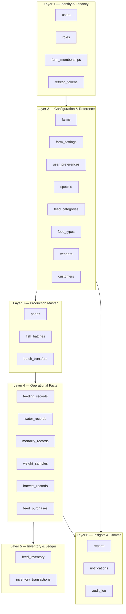

# Database Schema Layers

> **Source:** [Database Architecture §1.4](../architecture/02-database-architecture.md#14-schema-layers)

## Layer Diagram

## Tenancy Boundary

All operational data (Layers 3–6) is scoped by `farm_id`. See [ADR-013](../adr/ADR-013-farm_id-tenant-scoping-at-repository-level.md).

## Related Documents

- [Database Architecture](../architecture/02-database-architecture.md)
- [Complete ERD](./database-erd.md)
- [Database Index](../database/README.md)
