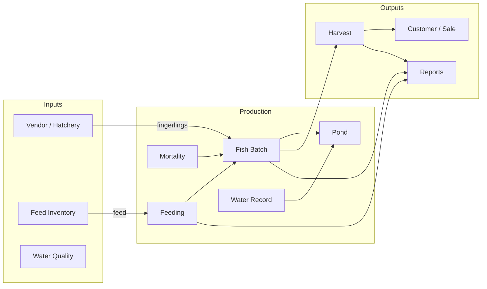
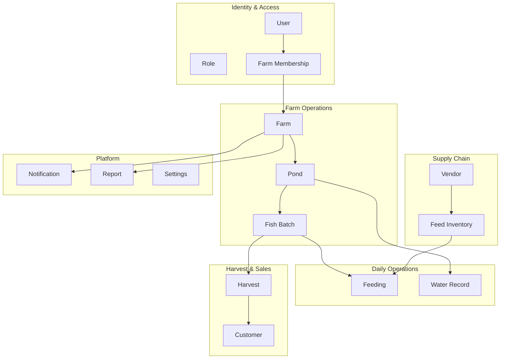

# Domain Value Chain

> **Source:** [Domain Model §1](../architecture/01-domain-model.md#1-complete-domain-model)

The PondDesk domain is organized around one primary value chain: convert fingerlings into harvestable biomass through controlled pond operations.

## Value Chain Diagram

## Bounded Contexts

## Related Documents

- [Domain Model](../architecture/01-domain-model.md)
- [Business Workflows](../architecture/01-domain-model.md#4-business-workflows)
- [Fish Batch Lifecycle](./batch-lifecycle.md)
- [Database ERD](./database-erd.md)
